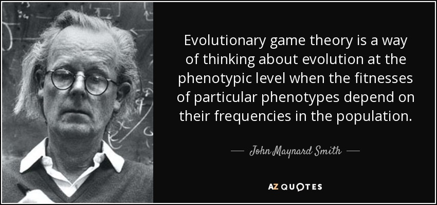

```{r setup, include=FALSE}
require(rmarkdown)
require(xaringan)
require(xaringanExtra)
require(knitr)
require(icons)
require(emo)
options(htmltools.dir.version = FALSE)
# preset code chunk options
knitr::opts_chunk$set(dpi = 300,            # ensures high resolution images
                      echo = FALSE,         # FALSE: code chunks don't show
                      warning = FALSE,      # FALSE: suppresses warning messages
                      error = FALSE,       # FALSE: Suppresses error messages
                      fig.align = "center")

```


```{r xaringan-slide-tone, echo=FALSE}
xaringanExtra::use_slide_tone()
```


# Announcements

<br/><br/>

- For questions on grading or any other topic related to the class, let's make use of office hours.

- The recording of the lectures are posted on canvas 24 h after class

- The recording of recitations together with the slides are also posted on canvas

- We will catch up on grading this week!

---

# Outline

<br/><br/>

- What game theory is and how/why it is applied to biology

--

- Evolutionarily stable strategies (ESS) and frequency dependent selection

--

- Examples

---

# Netlogo Model of Hawk-Dove Games

<br/><br/>

- Download NetLogo from [here](https://ccl.northwestern.edu/netlogo/6.2.0/). NetLogo does have an HTML format but this model is too outdated to be used on it


- Download the Hawk - Dove model [here](https://drive.google.com/file/d/1_OowptjexVBiWE0FBsq8pH82uI0dBjEd/view?usp=sharing)


---

# Game Theory

<br/><br/>

- Game Theory is the study of mathematical models of conflict and cooperation

--


- Forms the basis of many economic theories, war strategies, sociological theories, and even board games

--


- John Maynard Smith emphasized the potential for its use in behavioral ecology

---


# Evolutionary Game Theory


Evolutionary game theory focuses more on dynamics of strategy change. Influenced by the frequency of the competing strategies in the population

<center>

.pull-left[


]

.pull-right[



]

</center>


---

# Behavioral polymorphism

- Two or more morphs in a population or species

- Constant competition/cooperation between them

<center>

.pull-left[


]

.pull-right[


]

</center>

---

# Game theory features


- Individual players make decisions

--

- The players will behave rationally, and according to some criterion of self-interest

--

- The strategy of each individual will depend in part by the strategies of the other players


<center>


---


# Evolutionary game theory models

.pull-left[


]

.pull-right[

`r colorize("Dylan", "orange")` and `r colorize("Katy", "skyblue")` were arrested the same day!

- 2 years for drugs

- If confess, 1 year and the other 10 years

- If deny, 10 years and the other 1 year

- If both confess, both get 3 years

]


---


# Evolutionary game theory models

.pull-left[


]


.pull-right[

`r colorize("Dylan", "orange")` and `r colorize("Katy", "skyblue")` were arrested the same day!

- 2 years for drugs

- If confess, 1 year and the other 10 years

- If deny, 10 years and the other 1 year

- If both confess, both get 3 years

<br>

# &nbsp;&nbsp;&nbsp;&nbsp;`r colorize("Payoff Matrix", "skyblue")`


]


---

# The prisoner's dilemma


.pull-left[

`r colorize("Dylan", "orange")` and `r colorize("Katy", "skyblue")` were arrested the same day!

- 2 years for drugs

- If confess, 1 year and the other 10 years

- If deny, 10 years and the other 1 year

- If both confess, both get 3 years

<br>

# &nbsp;&nbsp;&nbsp;&nbsp;`r colorize("Payoff Matrix", "skyblue")`

]

.pull-right[


```{r echo = FALSE, out.width = "100%"}

plot(seq(0, 2, by = 1) ~ seq(-1, 1, by = 1), type = "n", xaxt = "n", yaxt = "n", ylab = "", xlab = "", mar = c(5, 8, 1, 0))
box(lwd = 3)
segments(0, -1, 0, 2.5, lwd = 1.5)
segments(-2, 1, 2, 1, lwd = 1.5)
segments(-1.1, 2.1, 1.08, -0.08, lwd = 1.5)
segments(0, 2.08, 1.08, 1, lwd = 1.5)
segments(-1.08, 1, 0, -0.08, lwd = 1.5)
mtext(text = "Confess", side = 2, at = 1.5, line = 2, cex = 2, col = "skyblue", font = 2)
mtext(text = "Deny", side = 2, at = 0.5, line = 2, cex = 2, col = "skyblue", font = 2)
mtext(text = "Confess", side = 3, at = -0.5, line = 2, cex = 2, col = "orange", font = 2)
mtext(text = "Deny", side = 3, at = 0.5, line = 2, cex = 2, col = "orange", font = 2)

```

]


---

# The prisoner's dilemma


.pull-left[

`r colorize("Dylan", "orange")` and `r colorize("Katy", "skyblue")` were arrested the same day!

- 2 years for drugs

- If confess, 1 year and the other 10 years

- If deny, 10 years and the other 1 year

- If both confess, both get 3 years

<br>

# &nbsp;&nbsp;&nbsp;&nbsp;`r colorize("Payoff Matrix", "skyblue")`

]

.pull-right[


```{r echo = FALSE, out.width = "100%"}

plot(seq(0, 2, by = 1) ~ seq(-1, 1, by = 1), type = "n", xaxt = "n", yaxt = "n", ylab = "", xlab = "", mar = c(5, 8, 1, 0))
box(lwd = 3)
segments(0, -1, 0, 2.5, lwd = 1.5)
segments(-2, 1, 2, 1, lwd = 1.5)
segments(-1.1, 2.1, 1.08, -0.08, lwd = 1.5)
segments(0, 2.08, 1.08, 1, lwd = 1.5)
segments(-1.08, 1, 0, -0.08, lwd = 1.5)
mtext(text = "Confess", side = 2, at = 1.5, line = 2, cex = 2, col = "skyblue", font = 2)
mtext(text = "Deny", side = 2, at = 0.5, line = 2, cex = 2, col = "skyblue", font = 2)
mtext(text = "Confess", side = 3, at = -0.5, line = 2, cex = 2, col = "orange", font = 2)
mtext(text = "Deny", side = 3, at = 0.5, line = 2, cex = 2, col = "orange", font = 2)


text(x = -0.25, y = 1.75, "3", col = "orange", font = 2, cex = 3)
text(x = -0.75, y = 1.25, "3", col = "skyblue", font = 2, cex = 3)

```

]

---

# The prisoner's dilemma


.pull-left[

`r colorize("Dylan", "orange")` and `r colorize("Katy", "skyblue")` were arrested the same day!

- 2 years for drugs

- If confess, 1 year and the other 10 years

- If deny, 10 years and the other 1 year

- If both confess, both get 3 years

<br>

# &nbsp;&nbsp;&nbsp;&nbsp;`r colorize("Payoff Matrix", "skyblue")`

]

.pull-right[


```{r echo = FALSE, out.width = "100%"}

plot(seq(0, 2, by = 1) ~ seq(-1, 1, by = 1), type = "n", xaxt = "n", yaxt = "n", ylab = "", xlab = "", mar = c(5, 8, 1, 0))
box(lwd = 3)
segments(0, -1, 0, 2.5, lwd = 1.5)
segments(-2, 1, 2, 1, lwd = 1.5)
segments(-1.1, 2.1, 1.08, -0.08, lwd = 1.5)
segments(0, 2.08, 1.08, 1, lwd = 1.5)
segments(-1.08, 1, 0, -0.08, lwd = 1.5)
mtext(text = "Confess", side = 2, at = 1.5, line = 2, cex = 2, col = "skyblue", font = 2)
mtext(text = "Deny", side = 2, at = 0.5, line = 2, cex = 2, col = "skyblue", font = 2)
mtext(text = "Confess", side = 3, at = -0.5, line = 2, cex = 2, col = "orange", font = 2)
mtext(text = "Deny", side = 3, at = 0.5, line = 2, cex = 2, col = "orange", font = 2)


text(x = -0.25, y = 1.75, "3", col = "orange", font = 2, cex = 3)
text(x = -0.75, y = 1.25, "3", col = "skyblue", font = 2, cex = 3)
text(x = 0.75, y = 1.75, "10", col = "orange", font = 2, cex = 3)
text(x = 0.25, y = 1.25, "1", col = "skyblue", font = 2, cex = 3)

```

]

---

# The prisoner's dilemma


.pull-left[

`r colorize("Dylan", "orange")` and `r colorize("Katy", "skyblue")` were arrested the same day!

- 2 years for drugs

- If confess, 1 year and the other 10 years

- If deny, 10 years and the other 1 year

- If both confess, both get 3 years

<br>

# &nbsp;&nbsp;&nbsp;&nbsp;`r colorize("Payoff Matrix", "skyblue")`

]

.pull-right[


```{r echo = FALSE, out.width = "100%"}

plot(seq(0, 2, by = 1) ~ seq(-1, 1, by = 1), type = "n", xaxt = "n", yaxt = "n", ylab = "", xlab = "", mar = c(5, 8, 1, 0))
box(lwd = 3)
segments(0, -1, 0, 2.5, lwd = 1.5)
segments(-2, 1, 2, 1, lwd = 1.5)
segments(-1.1, 2.1, 1.08, -0.08, lwd = 1.5)
segments(0, 2.08, 1.08, 1, lwd = 1.5)
segments(-1.08, 1, 0, -0.08, lwd = 1.5)
mtext(text = "Confess", side = 2, at = 1.5, line = 2, cex = 2, col = "skyblue", font = 2)
mtext(text = "Deny", side = 2, at = 0.5, line = 2, cex = 2, col = "skyblue", font = 2)
mtext(text = "Confess", side = 3, at = -0.5, line = 2, cex = 2, col = "orange", font = 2)
mtext(text = "Deny", side = 3, at = 0.5, line = 2, cex = 2, col = "orange", font = 2)


text(x = -0.25, y = 1.75, "3", col = "orange", font = 2, cex = 3)
text(x = -0.75, y = 1.25, "3", col = "skyblue", font = 2, cex = 3)
text(x = 0.75, y = 1.75, "10", col = "orange", font = 2, cex = 3)
text(x = 0.25, y = 1.25, "1", col = "skyblue", font = 2, cex = 3)
text(x = -0.25, y = 0.75, "1", col = "orange", font = 2, cex = 3)
text(x = -0.75, y = 0.25, "10", col = "skyblue", font = 2, cex = 3)

```

]

---

# The prisoner's dilemma


.pull-left[

`r colorize("Dylan", "orange")` and `r colorize("Katy", "skyblue")` were arrested the same day!

- 2 years for drugs

- If confess, 1 year and the other 10 years

- If deny, 10 years and the other 1 year

- If both confess, both get 3 years

<br>

# &nbsp;&nbsp;&nbsp;&nbsp;`r colorize("Payoff Matrix", "skyblue")`

]

.pull-right[


```{r echo = FALSE, out.width = "100%"}

plot(seq(0, 2, by = 1) ~ seq(-1, 1, by = 1), type = "n", xaxt = "n", yaxt = "n", ylab = "", xlab = "", mar = c(5, 8, 1, 0))
box(lwd = 3)
segments(0, -1, 0, 2.5, lwd = 1.5)
segments(-2, 1, 2, 1, lwd = 1.5)
segments(-1.1, 2.1, 1.08, -0.08, lwd = 1.5)
segments(0, 2.08, 1.08, 1, lwd = 1.5)
segments(-1.08, 1, 0, -0.08, lwd = 1.5)
mtext(text = "Confess", side = 2, at = 1.5, line = 2, cex = 2, col = "skyblue", font = 2)
mtext(text = "Deny", side = 2, at = 0.5, line = 2, cex = 2, col = "skyblue", font = 2)
mtext(text = "Confess", side = 3, at = -0.5, line = 2, cex = 2, col = "orange", font = 2)
mtext(text = "Deny", side = 3, at = 0.5, line = 2, cex = 2, col = "orange", font = 2)


text(x = -0.25, y = 1.75, "3", col = "orange", font = 2, cex = 3)
text(x = -0.75, y = 1.25, "3", col = "skyblue", font = 2, cex = 3)
text(x = 0.75, y = 1.75, "10", col = "orange", font = 2, cex = 3)
text(x = 0.25, y = 1.25, "1", col = "skyblue", font = 2, cex = 3)
text(x = -0.25, y = 0.75, "1", col = "orange", font = 2, cex = 3)
text(x = -0.75, y = 0.25, "10", col = "skyblue", font = 2, cex = 3)
text(x = 0.75, y = 0.75, "2", col = "orange", font = 2, cex = 3)
text(x = 0.25, y = 0.25, "2", col = "skyblue", font = 2, cex = 3)

```

]

---

# The prisoner's dilemma


.pull-left[

`r colorize("Dylan", "orange")` and `r colorize("Katy", "skyblue")` were arrested the same day!

- 2 years for drugs

- If confess, 1 year and the other 10 years

- If deny, 10 years and the other 1 year

- If both confess, both get 3 years

<br>

# &nbsp;&nbsp;&nbsp;&nbsp;`r colorize("Nash Equilibrium", "skyblue")`

]

.pull-right[


```{r echo = FALSE, out.width = "100%"}

plot(seq(0, 2, by = 1) ~ seq(-1, 1, by = 1), type = "n", xaxt = "n", yaxt = "n", ylab = "", xlab = "", mar = c(5, 8, 1, 0))
box(lwd = 3)
segments(0, -1, 0, 2.5, lwd = 1.5)
segments(-2, 1, 2, 1, lwd = 1.5)
segments(-1.1, 2.1, 1.08, -0.08, lwd = 1.5)
segments(0, 2.08, 1.08, 1, lwd = 1.5)
segments(-1.08, 1, 0, -0.08, lwd = 1.5)
mtext(text = "Confess", side = 2, at = 1.5, line = 2, cex = 2, col = "skyblue", font = 2)
mtext(text = "Deny", side = 2, at = 0.5, line = 2, cex = 2, col = "skyblue", font = 2)
mtext(text = "Confess", side = 3, at = -0.5, line = 2, cex = 2, col = "orange", font = 2)
mtext(text = "Deny", side = 3, at = 0.5, line = 2, cex = 2, col = "orange", font = 2)


text(x = -0.25, y = 1.75, "3", col = "orange", font = 2, cex = 3)
text(x = -0.75, y = 1.25, "3", col = "skyblue", font = 2, cex = 3)
text(x = 0.75, y = 1.75, "10", col = "orange", font = 2, cex = 3)
text(x = 0.25, y = 1.25, "1", col = "skyblue", font = 2, cex = 3)
text(x = -0.25, y = 0.75, "1", col = "orange", font = 2, cex = 3)
text(x = -0.75, y = 0.25, "10", col = "skyblue", font = 2, cex = 3)
text(x = 0.75, y = 0.75, "2", col = "orange", font = 2, cex = 3)
text(x = 0.25, y = 0.25, "2", col = "skyblue", font = 2, cex = 3)

```

]

---

# Hawk-Dove game

<center>

.pull-left[


]

</center>

.pull-right[

1. Two competing organisms exploit the same resource

2. Competition is by displays (dove strategy) or fights (hawk strategy)

3. `r colorize("Hawks always beat doves in competition", "orange")`

4. `r colorize("When hawks meet hawks or doves meet doves, they get half of the resource", "orange")`

Payoffs:

- get resources: 50
- lose resources: 0
- lose fight (injury): 100
- cost of dove display: 10

]

---

# What is the best strategy? `r colorize("Hawk", "orange")` or `r colorize("Dove", "skyblue")`?

<center>

.pull-left[


$V=50$

$C=100$

$c=10$

<br>


]

</center>

.pull-right[


```{r echo = FALSE, out.width = "100%"}

plot(seq(0, 2, by = 1) ~ seq(-1, 1, by = 1), type = "n", xaxt = "n", yaxt = "n", ylab = "", xlab = "", mar = c(5, 8, 1, 0))
box(lwd = 3)
segments(0, -1, 0, 2.5, lwd = 1.5)
segments(-2, 1, 2, 1, lwd = 1.5)
mtext(text = "Hawk", side = 2, at = 1.5, line = 2, cex = 2, col = "orange", font = 2)
mtext(text = "Dove", side = 2, at = 0.5, line = 2, cex = 2, col = "skyblue", font = 2)
mtext(text = "Hawk", side = 3, at = -0.5, line = 2, cex = 2, col = "orange", font = 2)
mtext(text = "Dove", side = 3, at = 0.5, line = 2, cex = 2, col = "skyblue", font = 2)

text(x = -0.5, y = 1.5, "(V + [-C])/2", cex = 2)
text(x = 0.5, y = 1.5, "V", cex = 2)
text(x = -0.5, y = 0.5, "0", cex = 2)
text(x = 0.5, y = 0.5, "(V/2) - c", cex = 2)


```

]


---


# What is the best strategy? `r colorize("Hawk", "orange")` or `r colorize("Dove", "skyblue")`?


```{r echo = FALSE, out.width = "55%"}

plot(seq(0, 2, by = 1) ~ seq(-1, 1, by = 1), type = "n", xaxt = "n", yaxt = "n", ylab = "", xlab = "", mar = c(5, 8, 1, 0))
box(lwd = 3)
segments(0, -1, 0, 2.5, lwd = 1.5)
segments(-2, 1, 2, 1, lwd = 1.5)
mtext(text = "Hawk", side = 2, at = 1.5, line = 2, cex = 2, col = "orange", font = 2)
mtext(text = "Dove", side = 2, at = 0.5, line = 2, cex = 2, col = "skyblue", font = 2)
mtext(text = "Hawk", side = 3, at = -0.5, line = 2, cex = 2, col = "orange", font = 2)
mtext(text = "Dove", side = 3, at = 0.5, line = 2, cex = 2, col = "skyblue", font = 2)

text(x = -0.5, y = 1.5, "(V + [-C])/2 = -25", cex = 2)
text(x = 0.5, y = 1.5, "V = 50", cex = 2)
text(x = -0.5, y = 0.5, "0", cex = 2)
text(x = 0.5, y = 0.5, "(V/2) - c = 15", cex = 2)

```

---


# What is the best strategy? `r colorize("Hawk", "orange")` or `r colorize("Dove", "skyblue")`?


.pull-left[

```{r echo = FALSE, out.width = "90%"}

plot(seq(0, 2, by = 1) ~ seq(-1, 1, by = 1), type = "n", xaxt = "n", yaxt = "n", ylab = "", xlab = "", mar = c(5, 8, 1, 0))
box(lwd = 3)
segments(0, -1, 0, 2.5, lwd = 1.5)
segments(-2, 1, 2, 1, lwd = 1.5)
mtext(text = "Hawk", side = 2, at = 1.5, line = 2, cex = 2, col = "orange", font = 2)
mtext(text = "Dove", side = 2, at = 0.5, line = 2, cex = 2, col = "skyblue", font = 2)
mtext(text = "Hawk", side = 3, at = -0.5, line = 2, cex = 2, col = "orange", font = 2)
mtext(text = "Dove", side = 3, at = 0.5, line = 2, cex = 2, col = "skyblue", font = 2)

text(x = -0.5, y = 1.5, "(V + [-C])/2 = -25", cex = 2)
text(x = 0.5, y = 1.5, "V = 50", cex = 2)
text(x = -0.5, y = 0.5, "0", cex = 2)
text(x = 0.5, y = 0.5, "(V/2) - c = 15", cex = 2)

```

]


.pull-right[

<br><br>

The best strategy dependes on the frequency of other strategies

`r colorize("Hawks", "orange")`:

- Better than doves when many doves
- Worse than doves when many hawks

`r colorize("Doves", "skyblue")`:

- Better than hawks when many hawks
- Worse than hawks when many doves

]

---

# Modeling the dynamic of the population

.pull-left[

```{r echo = FALSE, out.width = "90%"}

plot(seq(-50, 50, by = 20) ~ seq(0, 1, by = 0.2), type = "n", ylab = "Average payoff (fitness)", xlab = "Hawk frequency", las = 1)
box(lwd = 3)
segments(0, 50, 1, -25, lwd = 3, col = "orange")
segments(0, 15, 1, 0, lwd = 3, col = "skyblue")


```

]


.pull-right[


```{r echo = FALSE, out.width = "40%"}

plot(seq(0, 2, by = 1) ~ seq(-1, 1, by = 1), type = "n", xaxt = "n", yaxt = "n", ylab = "", xlab = "", mar = c(5, 8, 1, 0))
box(lwd = 3)
segments(0, -1, 0, 2.5, lwd = 3)
segments(-2, 1, 2, 1, lwd = 3)
mtext(text = "Hawk", side = 2, at = 1.5, line = 2, cex = 2, col = "orange", font = 2)
mtext(text = "Dove", side = 2, at = 0.5, line = 2, cex = 2, col = "skyblue", font = 2)
mtext(text = "Hawk", side = 3, at = -0.5, line = 2, cex = 2, col = "orange", font = 2)
mtext(text = "Dove", side = 3, at = 0.5, line = 2, cex = 2, col = "skyblue", font = 2)

text(x = -0.5, y = 1.5, "(V + [-C])/2 = -25", cex = 2)
text(x = 0.5, y = 1.5, "V = 50", cex = 2)
text(x = -0.5, y = 0.5, "0", cex = 2)
text(x = 0.5, y = 0.5, "(V/2) - c = 15", cex = 2)

```

- There is an equilibrium hawk frequency, adding individuals of each strategy lowers fitness relative to the alternative strategy

- No best "pure" strategy, no `r colorize("Evolutionary Stable Strategy", "orange")`

- Fitness for strategies are **frequency dependant**


]

---

# Modeling the dynamic of the population

.pull-left[

```{r echo = FALSE, out.width = "90%"}

plot(seq(-50, 50, by = 20) ~ seq(0, 1, by = 0.2), type = "n", ylab = "Average payoff (fitness)", xlab = "Hawk frequency", las = 1)
box(lwd = 3)
segments(0, 50, 1, -25, lwd = 3, col = "orange")
segments(0, 15, 1, 0, lwd = 3, col = "skyblue")
arrows(0.583, -45, 0.583, 5, lwd = 2, code = 2)

```

]


.pull-right[


```{r echo = FALSE, out.width = "40%"}

plot(seq(0, 2, by = 1) ~ seq(-1, 1, by = 1), type = "n", xaxt = "n", yaxt = "n", ylab = "", xlab = "", mar = c(5, 8, 1, 0))
box(lwd = 3)
segments(0, -1, 0, 2.5, lwd = 3)
segments(-2, 1, 2, 1, lwd = 3)
mtext(text = "Hawk", side = 2, at = 1.5, line = 2, cex = 2, col = "orange", font = 2)
mtext(text = "Dove", side = 2, at = 0.5, line = 2, cex = 2, col = "skyblue", font = 2)
mtext(text = "Hawk", side = 3, at = -0.5, line = 2, cex = 2, col = "orange", font = 2)
mtext(text = "Dove", side = 3, at = 0.5, line = 2, cex = 2, col = "skyblue", font = 2)

text(x = -0.5, y = 1.5, "(V + [-C])/2 = -25", cex = 2)
text(x = 0.5, y = 1.5, "V = 50", cex = 2)
text(x = -0.5, y = 0.5, "0", cex = 2)
text(x = 0.5, y = 0.5, "(V/2) - c = 15", cex = 2)

```

- There is an equilibrium hawk frequency, adding individuals of each strategy lowers fitness relative to the alternative strategy

- No best "pure" strategy, no `r colorize("Evolutionary Stable Strategy", "orange")`

- Fitness for strategies are **frequency dependant**


]


---

# Modeling the dynamic of the population

.pull-left[

```{r echo = FALSE, out.width = "90%"}

plot(seq(-50, 50, by = 20) ~ seq(0, 1, by = 0.2), type = "n", ylab = "Average payoff (fitness)", xlab = "Hawk frequency", las = 1)
box(lwd = 3)
segments(0, 50, 1, -25, lwd = 3, col = "orange")
segments(0, 15, 1, 0, lwd = 3, col = "skyblue")
arrows(0.583, -45, 0.583, 5, lwd = 2, code = 2)

```

]


.pull-right[


```{r echo = FALSE, out.width = "50%"}

plot(seq(0, 2, by = 1) ~ seq(-1, 1, by = 1), type = "n", xaxt = "n", yaxt = "n", ylab = "", xlab = "", mar = c(5, 8, 1, 0))
box(lwd = 3)
segments(0, -1, 0, 2.5, lwd = 3)
segments(-2, 1, 2, 1, lwd = 3)
mtext(text = "Hawk", side = 2, at = 1.5, line = 2, cex = 2, col = "orange", font = 2)
mtext(text = "Dove", side = 2, at = 0.5, line = 2, cex = 2, col = "skyblue", font = 2)
mtext(text = "Hawk", side = 3, at = -0.5, line = 2, cex = 2, col = "orange", font = 2)
mtext(text = "Dove", side = 3, at = 0.5, line = 2, cex = 2, col = "skyblue", font = 2)

text(x = -0.5, y = 1.5, "(V-C)/2 = -25", cex = 2)
text(x = 0.5, y = 1.5, "V = 50", cex = 2)
text(x = -0.5, y = 0.5, "0", cex = 2)
text(x = 0.5, y = 0.5, "(V/2) - c = 15", cex = 2)

```

- The fitness of individuals is lower at equilibrium than in all dove population

- Individual selection > group selection

- `r colorize("Selection acts to lower the population mean fitness", "orange")`

]


---

# Time for Netlogo


